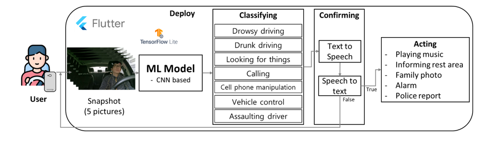

# AI Drive Assistant

## Problem Definition

- Research indicates that a significant portion of traffic accidents, surpassing 50 percent, can be attributed to drivers' failure to adhere to safe driving practices. These practices include neglecting forward observation, engaging in reckless driving behaviors, using mobile devices while driving, and operating vehicles while fatigued. In response to this issue, our team has devised a service aimed at establishing an environment conducive to driver focus by actively monitoring driving conditions. The introduction of an artificial intelligence (AI) model designed to function as a standalone assistant during solitary driving scenarios holds great potential. This AI model is expected to effectively handle unforeseen circumstances and ensure a driver's emotional well-being and concentration remain consistently at a suitable level for safe driving.

- The application employs monitoring techniques to assess the user's condition and subsequently offers tailored services categorized as normal, drowsy driving, mobile phone manipulation, driver aggression, drunk driving, and object detection. The specific services provided based on the monitoring status are presented in the following table:

|Monitoring Status|Services|
|:--:|:--:|
|Normal|Continuous monitoring|
|Drunk driving|Warning sounds and police reports|
|Driver assault|Warning sounds and police reports|
|Drowsy driving|An acting song|
|Mobile phone manipulation|A warning sound|
|Looking for things|A warning sound|

- The application's ability to classify the user's condition and offer appropriate services contributes to enhancing driver safety and reducing the occurrence of accidents associated with various risky driving behaviors. 

## System Desing (Project Overview)

- As illustrated in the diagram, the service delivery process involves capturing images, diagnosing the driver's state, confirming the state, and providing suitable services. To ensure the efficiency of the artificial intelligence (AI) model and the minimal data requirements for the application's operation, a channel-wise stacking technique is employed, where five photos are stacked as input data. Convolutional Neural Network (CNN)-based models are utilized for the AI models, and after training with TensorFlow, they are converted to TensorFlow Lite for mobile usage.
- By monitoring the driver, their condition can be classified based on their driving behavior. To ensure accurate service provision and confirm the driver's intention, a voice-based reconfirmation process was implemented. During this phase, the application retrieves the name provided during the initial setup and uses it to address the driver. For instance, it may say, "Mr. OOO, are you currently feeling drowsy?" This approach effectively captures the driver's attention and alerts them to any abnormal behavior.
- Lastly, once the driver's condition is confirmed, appropriate services can be provided. This comprehensive process ensures accurate assessment and personalized assistance, enhancing the effectiveness of the application in promoting driver safety 

## Data
